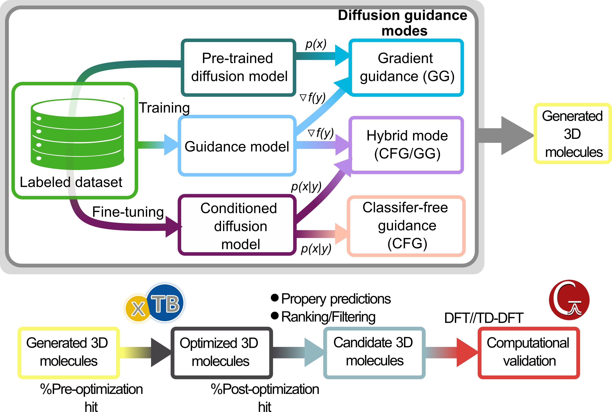
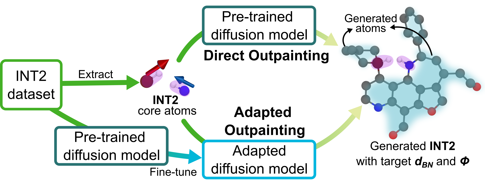

# Application: Inverse Design

Inverse design uses MolCraftDiffusion to generate molecules that **satisfy a predefined objective** rather than simply resembling the training data. Two common objective types are especially relevant:

| Route | Objective | Mechanism |
| :--- | :--- | :--- |
| **Property-directed** | Target a scalar property (energy, excitation, score) | CFG, gradient guidance, or hybrid |
| **Geometry-directed** | Target a 3D arrangement (distance, angle, spatial motif) | Structure-guided generation + descriptor filtering |

---

## 1. Target Property Inverse Design

Use this route when you want to **bias generation toward a numerical target** such as an energy score, excitation-related objective, or another learned molecular property.

*Conceptual view: the diffusion model is combined with guidance models so generation is biased toward molecules with the desired target profile, followed by ranking and computational validation.*

### Concept

The model is no longer asked to generate molecules that are only plausible. It is asked to generate molecules that are plausible **and** biased toward a desired property target.

::::{note}
This is the right framing when your question is:

- Can I **shift generation** toward a target electronic or physicochemical regime?
- Can I **enrich the output** in molecules with better scores?
- Can I **search for hits** without manually enumerating structures?
::::

MolCraftDiffusion supports this through **classifier-free guidance (CFG)**, **gradient guidance (GG)**, and **hybrid guidance**.

### Where to Go Next

::::{seealso}
- [Tutorial 7: Property-Directed Generation](../tutorials/07_property_directed.md)
- [Tutorial 8: Property Prediction and Evaluation](../tutorials/08_eval_predict.md)
- [Tutorial 9: Analysis](../tutorials/09_analyze.md)

**Starting templates:**

| Config | Guidance mode |
| :--- | :--- |
| `docs/cfg_examples/gen_cfg.yaml` | Classifier-free guidance |
| `docs/cfg_examples/gen_gradient_guidance.yaml` | Gradient guidance |
| `docs/cfg_examples/gen_hybrid_cfg_gg.yaml` | Hybrid CFG + GG |

**Application scripts (singlet-fission use case):**

- `scripts/applications/singlet_fission/extract_gen_hit.py`
- `scripts/applications/singlet_fission/extract_g16_output.py`
::::

---

## 2. Target Geometry Inverse Design

Use this route when the design objective is primarily **structural** — for example a target distance, angle, or spatial arrangement between functional groups.

*Conceptual view: a core motif is preserved while structure-guided generation builds candidates that satisfy a target 3D arrangement.*

### Concept

In this setting, the target is not just a scalar property. The target is a **geometric arrangement** that the generated molecule should realize in 3D space.

::::{note}
This is the right framing when your question is:

- Can I generate molecules that **place key atoms** at the right distance or angle?
- Can I **keep a reactive core** while varying the surrounding structure?
- Can I **enrich for candidates** that satisfy a geometry-driven design hypothesis?
::::

This typically combines structure-guided generation with **descriptor-based filtering** and downstream evaluation.

### Where to Go Next

::::{seealso}
- [Tutorial 6: Structure-Guided Generation](../tutorials/06_structure_guided.md)
- [Tutorial 8: Property Prediction and Evaluation](../tutorials/08_eval_predict.md)
- [Tutorial 9: Analysis](../tutorials/09_analyze.md)

**Application scripts (IFLP geometry-targeting use case):**

- `scripts/applications/iflp_geom_target/compute_iflp_geom_desc.py`
- `scripts/applications/iflp_geom_target/process_int2_database.py`
::::

---

## 3. General Advice

::::{important}
Keep these principles in mind for any inverse design campaign:

1. **Start permissive, tighten later.** Use relaxed generation settings first and apply stricter selection criteria once you see the output distribution.
2. **Separate validity from objective satisfaction.** High target scores alone are not enough — confirm the molecule is chemically reasonable.
3. **Re-rank with external calculations.** Physics- or chemistry-based checks (xTB, DFT) matter for any high-value campaign.
4. **Treat guidance strength as a trade-off.** Stronger guidance improves objective alignment but can reduce structural realism.
::::
