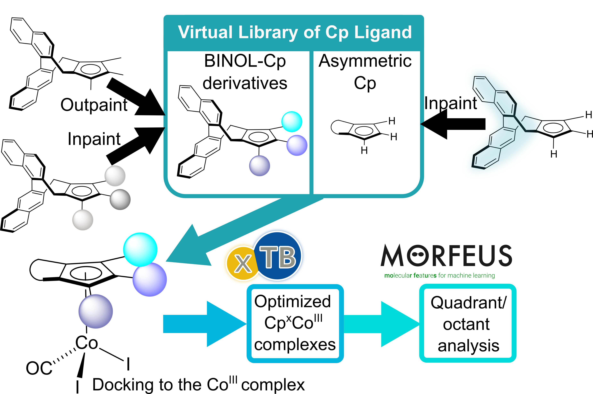

# Application: Library Design with Structure-Directed Generation

This workflow uses **structure-directed generation** to build a focused virtual library from a predefined scaffold. In practice, this usually means **outpainting** from a fixed core, optionally combined with filtering and descriptor calculations to cover a desired design space.

---

## When to Use This

::::{tip}
Use library design when you want to:

- **keep a core scaffold fixed** across all generated candidates,
- **enumerate chemically diverse decorations** around selected growth sites,
- **build a screening library** with broad steric or physicochemical coverage.
::::

The BINOL-Cp example from the manuscript follows this pattern: a fixed ligand scaffold is expanded into a broader virtual library, then analyzed with downstream steric descriptors.



*Conceptual view of the library-design workflow from the paper: scaffold-based generation is used to create Cp ligand variants, which are then optimized and analyzed in descriptor space.*

---

## Conceptual Workflow

```text
  [Choose scaffold XYZ file]
            |
            v
[Define connector / growth atoms]
            |
            v
 [Outpainting: fix core scaffold,
  generate decorations]
            |
            v
  [Filter + analyze: steric,
   physicochemical coverage]
            |
            v
    [Virtual screening library]
```

The point of this workflow is to balance **control** and **diversity**. You keep the part of the molecule you care about, but allow the model to explore decorations around it.

---

## Why This Matters

::::{note}
This is a useful mode when you want to move from a **single scaffold** to a **screening set**. It helps answer questions such as:

- How can I expand a known core into a more **diverse virtual library**?
- Which substitutions give **broad steric or property coverage**?
- How can I generate candidates that are **related enough to compare**, but **diverse enough to screen**?
::::

---

## Where to Go Next

::::{seealso}
For the actual workflow, use:

- [Tutorial 6: Structure-Guided Generation](../tutorials/06_structure_guided.md) — outpainting
- [Tutorial 9: Analysis](../tutorials/09_analyze.md) — filtering and evaluating the generated library

**Starting template:** [`docs/cfg_examples/gen_outpaint.yaml`](../cfg_examples/gen_outpaint.yaml)
::::

This repository also includes application-specific helper scripts for the virtual-library example:

| Script | Purpose |
| :--- | :--- |
| `scripts/applications/virtual_lib_cp/filter_cp.py` | Filter generated Cp ligand candidates |
| `scripts/applications/virtual_lib_cp/compute_steric_descriptor.py` | Compute steric descriptors |
| `scripts/applications/virtual_lib_cp/process_dir.py` | Batch-process a directory of structures |
