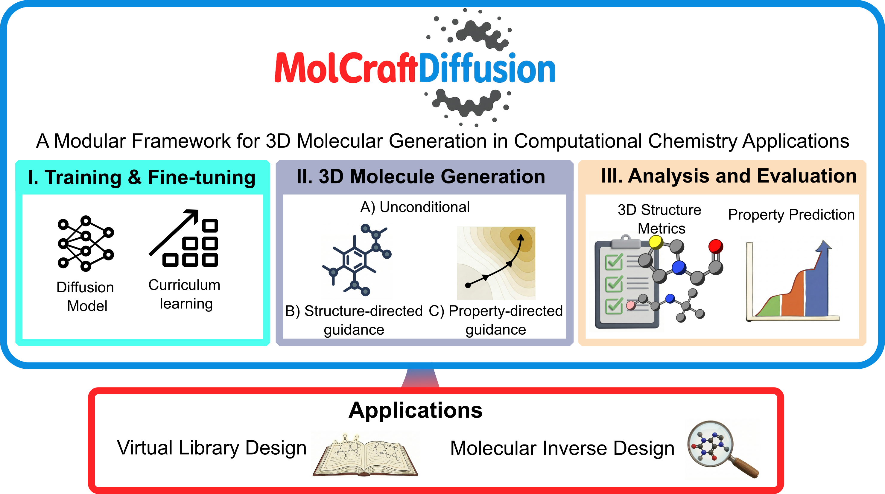

# MolCraftDiffusion

**One platform for diverse 3D molecular generation workflows.**

MolCraftDiffusion is an open-source framework for building, training, applying, and comparing **3D molecular generative models** in computational chemistry. It supports de novo, property-directed, structure-guided, shape-conditioned, pocket-conditioned, fragment-based, and pharmacophore-driven molecular design.

The platform unifies data preparation, training and fine-tuning, guided generation, checkpoint handling, and evaluation behind a shared CLI and configuration system. Different generative paradigms can therefore use the same surrounding infrastructure without requiring separate end-to-end codebases. A no-code browser UI, [AutomaticMolCraft](https://github.com/lcmd-epfl/AutomaticMolCraft), is also available for users who prefer not to work from the CLI.



[](https://github.com/pregHosh/MolCraftDiffusion)
[](https://pypi.org/project/molcraftdiffusion/)
[](https://chemrxiv.org/engage/chemrxiv/article-details/6909e50fef936fb4a23df237)
[](https://zenodo.org/records/19511401)
[](https://huggingface.co/pregH/MolecularDiffusion)
[](https://huggingface.co/pregH/MolecularDiffusion)
[](https://github.com/lcmd-epfl/AutomaticMolCraft)

---

## Key Features

MolCraftDiffusion is built around a common task interface, allowing generators with different architectures and conditioning inputs to share the platform infrastructure.

- **Data Module** — Preprocess, compile, and manage raw `.xyz` files into unified `.db` (ASE Database) pipelines, and annotate properties.
- **Training & Fine-Tuning Module** — Train or adapt generative models, property regressors, and time-aware guidance models.
- **Broad Generator Coverage** — Apply multiple 3D generation paradigms across de novo and conditioned molecular-design tasks.
- **Generation & Guidance Module** — Generate 3D molecules using a variety of mechanisms:
  - *Unconditional Generation*: Generate 3D molecules without any specific constraints or guidance.
  - *Property-Targeted Guidance*: Steer generation towards desired properties using Classifier-Free Guidance (CFG), Gradient Guidance (GG), or a hybrid approach.
  - *Structure-Guided Generation*: Perform inpainting (scaffold decoration), outpainting (fragment extension) and SILVR (soft reference steering / fragment merging) with precise 3D geometric constraints.
- **Analysis & Evaluation Module** — Assess generated molecules with structural validity metrics, xTB geometry optimisation, RMSD comparisons, and quantum-chemical property calculation or prediction.

---

## Web Interface

Prefer a browser to the CLI? [AutomaticMolCraft](https://github.com/lcmd-epfl/AutomaticMolCraft) is a no-code web UI built on top of MolCraftDiffusion — property-guided generation, structure-guided inpainting/outpainting, training configuration, dataset curation, and linked 2D/3D visualization, served locally via `dev.sh`.

---

## Quick Start

```bash
# Train a diffusion model
MolCraftDiff train my_config

# Generate molecules
MolCraftDiff generate my_gen_config

# Analyse outputs
MolCraftDiff analyze metrics generated_molecules/
```

**No model of your own yet?** The [Model Zoo](model_zoo/index.md) ships pretrained weights, the datasets behind them, and a runnable config for every model on the platform — so you can generate molecules before training anything:

```bash
MolCraftDiff zoo list                        # see what is available
MolCraftDiff zoo fetch --model kgdiff
MolCraftDiff generate examples/kgdiff_generate.yaml
```

Ready-to-use template configuration files for common workflows are listed in [Configuration Templates](config_templates.md), with the full packaged Hydra defaults under `src/MolecularDiffusion/configs/`. Copy the relevant file, fill in your paths, and run:

```bash
# Example: unconditional generation with the template
cp docs/cfg_examples/gen_unconditional.yaml my_gen.yaml
# edit my_gen.yaml → set chkpt_directory
MolCraftDiff generate my_gen
```

---

## Contents

```{toctree}
:maxdepth: 1
:caption: Getting Started

installation
architectures
```

```{toctree}
:maxdepth: 1
:caption: Model Zoo

model_zoo/index
model_zoo/models
model_zoo/data
model_zoo/registering
```

```{toctree}
:maxdepth: 1
:caption: Tutorials

tutorials/index
```

```{toctree}
:maxdepth: 1
:caption: Applications

applications/index
```

```{toctree}
:maxdepth: 1
:caption: Workflows

workflows/index
```

```{toctree}
:maxdepth: 1
:caption: Configuration Templates

config_templates
```

```{toctree}
:maxdepth: 1
:caption: API Reference

api
```

---

## Citation

If you use MolCraftDiffusion in your research, please cite:

[](https://pubs.acs.org/doi/10.1021/jacs.5c19960)

[Modular Framework for 3D Molecular Generation in Computational Chemistry Applications](https://pubs.acs.org/doi/10.1021/jacs.5c19960), *Journal of the American Chemical Society*, 2026.

```bibtex
@article{worakul_modular_2026,
	title = {Modular {Framework} for {3D} {Molecular} {Generation} in {Computational} {Chemistry} {Applications}},
	url = {https://pubs.acs.org/doi/10.1021/jacs.5c19960},
	doi = {10.1021/jacs.5c19960},
	journal = {Journal of the American Chemical Society},
	author = {Worakul, Thanapat and Azzouzi, Mohammed and Wodrich, Matthew D. and Corminboeuf, Clémence},
	month = jun,
	year = {2026},
	pages = {jacs.5c19960},
}
```

Related paper:

[](https://chemrxiv.org/doi/full/10.26434/chemrxiv.15005231/v1)

[A Diffusion Framework for Geometrically Valid and Practically Viable 3D Molecular Generation](https://chemrxiv.org/doi/full/10.26434/chemrxiv.15005231/v1).

```bibtex
@article{worakul_diffusion_2026,
	title = {A {Diffusion} {Framework} for {Geometrically} {Valid} and {Practically} {Viable} {3D} {Molecular} {Generation}},
	url = {https://chemrxiv.org/doi/full/10.26434/chemrxiv.15005231/v1},
	doi = {10.26434/chemrxiv.15005231/v1},
	publisher = {American Chemical Society (ACS)},
	author = {Worakul, Thanapat and Corminboeuf, Clémence},
	month = jun,
	year = {2026},
}
```
