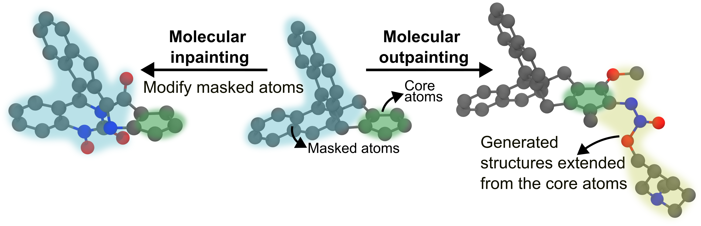

# Tutorial 6: Structure-Guided Generation

> **Prerequisites:** [Tutorial 5 — Generation Overview](05_generation_overview.md) · **You'll learn:** inpainting and outpainting with 3D geometric constraints, and how to tune every parameter · **Next:** [Tutorial 7 — Property-Directed Generation](07_property_directed.md)

This tutorial explains how to guide molecule generation using structural constraints, such as filling in a missing piece (inpainting) or growing a molecule from a fragment (outpainting).

:::{warning}
**Atom indices are tied to graph construction.** `mask_node_index` values are 0-indexed positions in the atom list of your XYZ file. If you preprocess the molecule (reorder atoms, remove hydrogens, add atoms) the indices will shift and the mask will apply to the wrong atoms — silently. Always double-check indices against the exact XYZ file passed to `reference_structure_path`, and set `use_noised_conditioning: true` only if the base model was trained with noised conditioning (check the training config).
:::

## Contents

1.  **Introduction**: The concept of guiding generation with a structural template.
2.  **Inpainting**: How to configure and run generation to fill in a missing portion of a molecule.
3.  **Outpainting**: How to grow a molecule from a given substructure.
4.  **Tuning Parameters**: Intuitive guide to tuning all parameters for both tasks.

## 1. Introduction

Structure-guided generation allows you to influence the output of the diffusion model by providing a starting molecular structure. This is useful for tasks like:

*   **Inpainting**: Varying initial structures (either the whole molecule or replacing a specific part of it).
*   **Outpainting**: Extending a molecule from a given fragment.




The process involves providing a reference structure in an XYZ file and specifying which parts of the structure to modify or keep fixed. **Note that all atom indices are 0-indexed.** You can create your experiment configuration files in any directory, as the base templates are bundled with the package.

---

## 2. Inpainting

Inpainting allows you to vary initial structures. You provide a template molecule and specify which atoms to "mask". The diffusion model will then generate new structures for the masked atoms and connect them to the rest of the molecule, allowing you to vary specific parts or the entire structure.

### Key Inpainting Parameters

The `condition_configs` section for inpainting uses a sub-dictionary called `inpaint_cfgs` to group all specific inpainting settings.

| Parameter | Location | Description |
| :--- | :--- | :--- |
| `mol_size` | `interference` (top-level) | The expected size of the final molecule. **This should be larger than or equal to the number of atoms in the reference structure.** |
| `reference_structure_path` | `condition_configs` | **CRITICAL:** Path to your own XYZ file containing the molecule you want to inpaint. |
| `condition_component` | `condition_configs` | Component to inpaint (`x` positions only, `h` features only, `xh` both). |
| `center_saved_scaffold` | `condition_configs` | Translate scaffold so its centre of mass is at the origin before generation. |
| `use_noised_conditioning` | `condition_configs` | Add noise to the scaffold at each denoising step. Set `True` if the model was trained with noised conditioning. |
| `n_retrys` | `condition_configs` | Number of retry attempts if a generated molecule is invalid. |
| `t_retry` | `condition_configs` | Timestep (0–T) to restart from on retry. |
| `n_frames` | `condition_configs` | Number of trajectory frames to save for visualisation (0 = disabled). |
| `mask_node_index` | `inpaint_cfgs` | **CRITICAL:** 0-indexed list of atom indices to remove and regenerate. |
| `denoising_strength` | `inpaint_cfgs` | How much noise is added to the masked region (0–1). Higher = more creative freedom, lower = stays closer to the original. |
| `noise_initial_mask` | `inpaint_cfgs` | Add noise to the initial masked positions before denoising starts. |
| `constraint_strength` | `inpaint_cfgs` | Fraction of denoising during which overlap-push constraints are active (`s < constraint_strength`). Default: `0.8`. |
| `scale_factor` | `inpaint_cfgs` | Multiplier on covalent radii for bond-distance tolerance. Default: `1.1`. |

### Configuration

```yaml
# my_inpaint.yaml
defaults:
  - tasks: diffusion
  - interference: gen_inpaint # Base template bundled with package
  - _self_

name: "akatsuki"
chkpt_directory: "models/edm_pretrained/"
atom_vocab: [H,B,C,N,O,F,Al,Si,P,S,Cl,As,Se,Br,I,Hg,Bi]
diffusion_steps: 600
seed: 9

interference:
  num_generate: 50
  mol_size: [50, 60]
  output_path: "results/my_inpainting_run"
  condition_configs:
    reference_structure_path: "path/to/your_molecule.xyz"   # your own XYZ file
    condition_component: xh
    inpaint_cfgs:
      mask_node_index: [5, 30, 31, 6, 7, 45, 8, 32, 9, 10, 33, 11, 34, 12, 35, 13, 36, 14, 15, 16, 17, 18, 37, 19, 38, 20, 39, 21, 40, 22, 23, 41, 24, 44, 25, 26, 43, 42]
      denoising_strength: 0.8
      constraint_strength: 0.8
      scale_factor: 1.1
```

### Running Inpainting

```bash
MolCraftDiff generate my_inpaint
```

---

## 3. Outpainting

Outpainting is the process of growing a molecule from a given fragment. You provide a starting fragment, and the model will add new atoms to it.

### Key Outpainting Parameters

The `condition_configs` section for outpainting uses a sub-dictionary called `outpaint_cfgs` to group all specific outpainting settings.

| Parameter | Location | Description |
| :--- | :--- | :--- |
| `mol_size` | `interference` (top-level) | The expected size of the final molecule (fragment + generated part). |
| `reference_structure_path` | `condition_configs` | **CRITICAL:** Path to your own XYZ file containing the fragment you want to grow from. |
| `condition_component` | `condition_configs` | Component to outpaint (`x`, `h`, or `xh`). |
| `center_saved_scaffold` | `condition_configs` | Translate scaffold so its CoM is at the origin before generation. |
| `use_noised_conditioning` | `condition_configs` | Add noise to the scaffold at each denoising step. |
| `n_retrys` | `condition_configs` | Number of retry attempts if a generated molecule is invalid. |
| `t_retry` | `condition_configs` | Timestep (0–T) to restart from on retry. |
| `connector_dicts` | `outpaint_cfgs` | **CRITICAL:** `{atom_index: [n_bonds]}` — which scaffold atoms to grow from and how many bonds each should form. |
| `t_start` | `outpaint_cfgs` | Fraction of T to start denoising from (e.g. `0.9` → 90% of steps). |
| `seed_dist` | `outpaint_cfgs` | Distance (Å) from connector to place initial seed atoms. Default: `2.0`. |
| `min_dist` | `outpaint_cfgs` | Minimum distance (Å) new atoms must be from all non-connector scaffold atoms at initialisation. Default: `1.0`. |
| `spread` | `outpaint_cfgs` | Std dev (Å) of the Gaussian used to scatter seed atoms around the seed position. Default: `1.0`. |
| `n_bq_atom` | `outpaint_cfgs` | Number of atoms at the end of the scaffold used only for seeding positions, not included in conditioning. Default: `0`. |
| `noise_initial_mask` | `outpaint_cfgs` | Add noise to the initial seed positions before denoising starts. |
| `constraint_strength` | `outpaint_cfgs` | Fraction of denoising during which constraints are active. Default: `0.7`. |
| `scale_factor` | `outpaint_cfgs` | Multiplier on covalent radii for bond-distance tolerance. Default: `1.1`. |

### Configuration

```yaml
# my_outpaint.yaml
defaults:
  - tasks: diffusion
  - interference: gen_outpaint # Base template bundled with package
  - _self_

name: "akatsuki"
chkpt_directory: "models/edm_pretrained/"
atom_vocab: [H,B,C,N,O,F,Al,Si,P,S,Cl,As,Se,Br,I,Hg,Bi]
diffusion_steps: 600
seed: 9

interference:
  num_generate: 50
  mol_size: [30, 40]
  output_path: "results/my_outpainting_run"
  condition_configs:
    reference_structure_path: "path/to/your_fragment.xyz"   # your own XYZ file
    condition_component: xh
    outpaint_cfgs:
      connector_dicts:
        1: [3]
        2: [3]
        3: [3]
      t_start: 0.8
      constraint_strength: 0.7
      scale_factor: 1.1
      seed_dist: 2.0
      min_dist: 1.0
      spread: 1.0
```

### Running Outpainting

```bash
MolCraftDiff generate my_outpaint
```

---

## 4. Tuning Parameters

This section explains the intuition behind every tunable parameter so you can diagnose and fix generation problems without trial-and-error guessing.

---

### 4.1 Inpainting Parameters

#### `denoising_strength` — how much to vary the masked region

This is the most important parameter for inpainting. It controls how far the masked atoms are scrambled before the model regenerates them. Think of it as a "creativity dial":

```
denoising_strength = 0.3   →  mild perturbation, output stays close to original
denoising_strength = 0.7   →  moderate variation, recommended starting point
denoising_strength = 1.0   →  full noise, model generates freely with no memory of original
```

**Use a low value** (`0.3–0.5`) when you want to explore small variations around a known structure — e.g., swapping a substituent while keeping the overall shape.

**Use a high value** (`0.8–1.0`) when you want the model to generate genuinely new chemistry in the masked region, or when the masked atoms are many and structurally diverse.

#### `mask_node_index` — which atoms to regenerate

Choose atoms that form a chemically coherent region: a ring system, a substituent, a linker. The atoms you do **not** mask become the frozen scaffold — make sure the unmasked atoms include all the atoms that define the shape you want to preserve.

**Tip:** The connector atoms (atoms at the boundary between masked and unmasked regions) are automatically detected from the molecular graph. You do not need to declare them separately.

#### `constraint_strength` (inpainting)

Controls when the overlap-push constraint is active during denoising. The constraint prevents generated atoms from crashing into the frozen scaffold.

**Leave at the default** (`0.8`) in most cases. Only reduce it if the scaffold is very small and the constraints are visibly over-correcting the trajectory.

:::{note}
The bonding sub-constraints (enforce + ensure_intact) are intentionally disabled for inpainting. Connector topology is determined from the molecular graph, so proximity-pull logic is not needed.
:::

#### `scale_factor` (inpainting)

Tolerance on bond distances. The overlap threshold for each atom pair is `(cov_radius_A + cov_radius_B) × scale_factor`.

**Raise to `1.2`** if generated atoms are clashing into the scaffold in the final structure. **Lower toward `1.0`** if bonds to the scaffold are consistently too long.

---

### 4.2 Outpainting Parameters

#### `connector_dicts` — where and how to grow

This is the only required parameter. Each entry `{atom_index: [n_bonds]}` says: *"from this scaffold atom, grow exactly n new bonds."*

**Choosing the connector atom:** Pick the atom at the growth point — usually an atom that is under-valenced in the scaffold (e.g., a carbon with a free valence after cleaving a bond).

**Choosing `n_bonds`:** Set this to the number of new bonds you want the connector atom to form with the generated fragment. For a single chain, use `[1]`. For a branching point, use `[2]` or `[3]`. The model is guided to place at least this many generated atoms within bonding distance of the connector.

#### `t_start` — how many denoising steps to run

`t_start` is the fraction of the total diffusion steps used for generation. It controls the quality–speed tradeoff:

```
t_start = 1.0   →  full denoising (all T steps), highest quality
t_start = 0.8   →  80% of steps, good quality, recommended default
t_start = 0.5   →  50% of steps, faster but coarser structures
```

**Use `0.8–0.9`** for most experiments. Only lower it for rapid screening where speed matters more than quality.

#### `seed_dist`, `min_dist`, `spread` — where new atoms start

These three parameters control the **initial placement** of the generated atoms before denoising begins. They shape the starting geometry that the model then refines.

```
connector atom (scaffold)
        │
        │← seed_dist (e.g. 1.5 Å) →●  ← seed point
                                   ╱│╲
                         spread (std dev of Gaussian)
                         atoms scattered around seed point
```

| Parameter | What it controls | Increase when… | Decrease when… |
| :--- | :--- | :--- | :--- |
| `seed_dist` | Distance from connector to the centre of the seed cloud | You want the fragment to grow outward and away from the scaffold | Fragment needs to start close to the connector (short bonds, rings) |
| `min_dist` | Minimum distance new atoms must be from all non-connector scaffold atoms at init | — (usually left at default) | Scaffold is large and seed atoms can't find valid positions far enough away |
| `spread` | How tightly the seed atoms are clustered around the seed point | You want a dispersed fragment exploring a wide area | You want a compact, directed fragment; high spread causes atoms to scatter and drift |

**Practical starting point:** `seed_dist=1.5, min_dist=1.5, spread=0.75` for a compact fragment growing from a single connector. Use `seed_dist=2.0, spread=1.0` for a more open-ended growth.

#### `n_bq_atom` — boundary atoms for seeding only

Adds phantom atoms at the end of the scaffold that are used only to compute seed positions, not passed to the model as conditioning. Useful when the scaffold's connector region is geometrically ambiguous and you want to steer the seed placement toward a specific spatial direction without altering the conditioning.

**Leave at `0`** unless you have a specific spatial steering need.

#### `constraint_strength` (outpainting)

Controls the denoising window during which geometric constraints are active:

```
s = 1.0  ──── generation starts (full noise)
             │  no constraints
s = constraint_strength  ──── overlap-push activates
             │  generated atoms pushed away from scaffold overlaps
s = constraint_strength / 2  ──── bonding sub-constraints activate
             │  atoms pulled toward connectors; disconnected clusters merged
s = 0.0  ──── generation ends (clean structure)
```

**Increase toward `0.9`** if generated atoms drift away from the connector or the final structure shows the fragment disconnected from the scaffold.

**Decrease toward `0.5`** if the fragment is too rigid, diversity is low, or you are generating a large fragment that needs space to explore.

**Default `0.7`** works well for typical fragment sizes (5–15 atoms). For very small fragments (1–3 atoms), try `0.8–0.9`. For large fragments (>20 atoms), try `0.5–0.6`.

#### `scale_factor` (outpainting)

Scales the per-atom-type covalent bond length threshold used by all three constraint layers:

| `scale_factor` | Bond tolerance | When to use |
| :--- | :--- | :--- |
| `0.9` | Tighter than covalent — atoms must be very close to connector | Connector is a light atom (N, O) and you want a tight bond |
| `1.0` | Exact covalent bond length | Reference bond lengths |
| `1.1` *(default)* | 10% slack | Good general-purpose starting point |
| `1.2–1.3` | Loose — allows more spacing | Heavy atoms around connector; prevents pile-up |

**Note:** `scale_factor` also affects the overlap-push constraint. A higher value means the push-away boundary is further from the scaffold surface, giving generated atoms more room to manoeuvre around heavy atoms.

---

### 4.3 Quick Diagnostics

#### Inpainting

| Symptom | Most likely cause | Fix |
| :--- | :--- | :--- |
| Output too similar to input | `denoising_strength` too low | Raise to `0.7–0.9` |
| Output unrecognisable, ignores scaffold shape | `denoising_strength` too high | Lower to `0.5–0.7` |
| Generated atoms crash into scaffold | `scale_factor` too low | Raise to `1.2` |
| Generated atoms hover far from scaffold | `scale_factor` too high | Lower to `1.0–1.05` |

#### Outpainting

| Symptom | Most likely cause | Fix |
| :--- | :--- | :--- |
| Fragment disconnected from scaffold in output | `constraint_strength` too low or `seed_dist` too large | Raise `constraint_strength` to `0.8–0.9`; lower `seed_dist` |
| Fragment fuses into scaffold, overlapping atoms | `scale_factor` too low | Raise `scale_factor` to `1.2–1.3` |
| Fragment is compact blob, no diversity | `spread` too low or `constraint_strength` too high | Raise `spread`; lower `constraint_strength` |
| Atoms pile up at connector | `seed_dist` too small; all atoms init at same point | Raise `seed_dist`; raise `spread` slightly |
| Fragment grows in the wrong direction | `seed_dist` too large, seed cloud too dispersed | Lower `seed_dist`; lower `spread` |
| Bonds to connector consistently too long | `scale_factor` too high | Lower to `1.0–1.05` |
| Generation is slow / low throughput | `t_start` too high | Lower to `0.7–0.8` |
